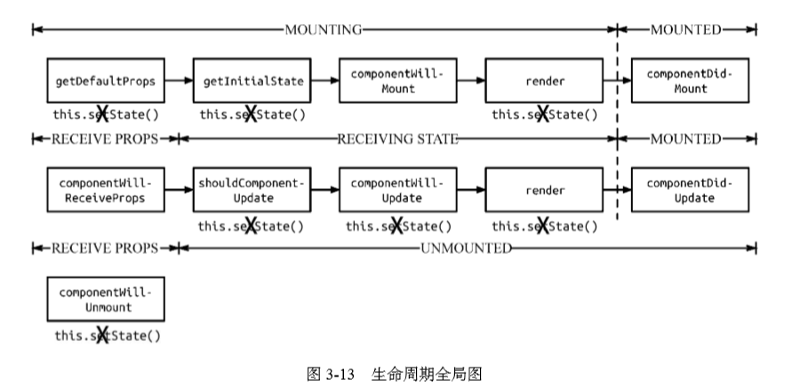

# React源码
> 生命周期；以及Diff算法&VD分析；**Diff算法**

## **生命周期**

可以将生命周期分为两个阶段，分别是`mount`以及`re-render`阶段。

1. `mount` - 只会在第一次渲染的时候执行一次
2. `re-render` - 会因为`state or props`更新执行多次

最后一个阶段是`unmounting`阶段。

> 要注意，这里的`mount rerender unmount`阶段意味着很多钩子函数的出发

**注意：** 图中`this.setState`被划掉意味着最好不要在这里调用`setstate`。那么其实只有**willmount and receiveprops**钩子函数最好使用`setstate`。

> 个人理解如果你在`didmount`调用`setstate`会触发`rerender`但是不会循环。因为属于`mount`阶段的钩子函数只会调用一次。如果你`setstate`，那么接下来的`rerender`应该就是`rerender`阶段的事情了。

> 不过如果你在`rerender`阶段的钩子函数里面调用`setstate`(除了`receiveprops`函数)，那么可能会可能会导致循环消耗内存。

**在其余钩子函数里面调用`setstate`可能会引起循环的更新。** 原因是因为 **`willmount receiveprops`** 两个钩子函数的调用`setstate`会合并`state`。

## setstate

* 在`mount`阶段调用的`setstate`会合并到一处进行更新。除非这个`setstate`是异步的方式。也就是非异步和异步是两个`setstate`的调用栈。

> 可以理解为`rerender`阶段的`setstate`是及时的。然而`mount`是`batch`合并的。而`mount`得异步则进入了`rerender`阶段吗？

## diff

原则

* 不同组件只会删除和创建
* 同一层级的组件会进行diff算法
* 跨层级的被`react`的忽略了，因为会比较少

特点：

* 好像之后移动操作，没有前移操作
  > 好像的确是这样，对于同一层级