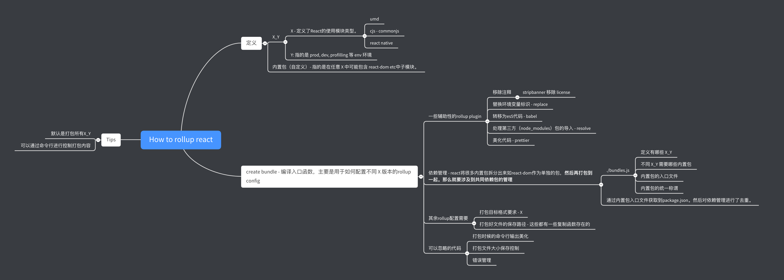

# 从代码编译入手
[[toc]]

> 虽然对`js`来说。编译是个不太需要的知识点。这里所说的编译指的是`es5->es6`，以及`ts->js`都可以这么认为。

> react在同一个包下管理多个子内置包；好处是多个平台使用同一个内置包（react-dom）之类，保证了接口的统一；且依赖也是统一的；


:::tip
以下会使用`X_Y`来指定对应的模块，如`UMD_DEV`。其中`X`指的是平台以及模块使用方式，`Y`指的是`env`。
（这里面模块有点歧义，指的是bundle文件类型，下文的模块也都是指的这个意思）
而模块内部如`react-dom etc`包，统一使用内置包代替。
:::

* [ ] - 检查模块含义是否统一
* [ ] - ipad思维导图绘制

## Package.json

**15->16** 构建工具的改变，依照[React-15.x](https://github.com/numbbbbb/read-react-source-code/blob/master/01-start-with-the-messy-build-process.md)里面提到的，构建工具从`grunt`变成了`rollup`。 

> 目的是为了支持多个版本的`JS`代码。主要是模块的`JS`模块的使用方式。所以这一点是和`babel`并没有冲突的，`babel`主要作用是`compile to es5`（不只是`JS`模块的使用）

从`package.json`的`scripts`查看脚本文件。

```json
{
  "scripts": {
    "build": "node ./scripts/rollup/build.js",
    "linc": "node ./scripts/tasks/linc.js",
    "lint": "node ./scripts/tasks/eslint.js",
    "lint-build": "node ./scripts/rollup/validate/index.js",
    "postinstall": "node node_modules/fbjs-scripts/node/check-dev-engines.js package.json && node ./scripts/flow/createFlowConfigs.js",
    "debug-test": "cross-env NODE_ENV=development node --inspect-brk node_modules/.bin/jest --config ./scripts/jest/config.source.js --runInBand",
    "test": "cross-env NODE_ENV=development jest --config ./scripts/jest/config.source.js",
    "test-persistent": "cross-env NODE_ENV=development jest --config ./scripts/jest/config.source-persistent.js",
    "test-fire": "cross-env NODE_ENV=development jest --config ./scripts/jest/config.source-fire.js",
    "test-new-scheduler": "cross-env NODE_ENV=development jest --config ./scripts/jest/config.source-new-scheduler.js",
    "test-prod": "cross-env NODE_ENV=production jest --config ./scripts/jest/config.source.js",
    "test-fire-prod": "cross-env NODE_ENV=production jest --config ./scripts/jest/config.source-fire.js",
    "test-prod-build": "yarn test-build-prod",
    "test-build": "cross-env NODE_ENV=development jest --config ./scripts/jest/config.build.js",
    "test-build-prod": "cross-env NODE_ENV=production jest --config ./scripts/jest/config.build.js",
    "flow": "node ./scripts/tasks/flow.js",
    "flow-ci": "node ./scripts/tasks/flow-ci.js",
    "prettier": "node ./scripts/prettier/index.js write-changed",
    "prettier-all": "node ./scripts/prettier/index.js write",
    "version-check": "node ./scripts/tasks/version-check.js"
  }
}
```

去掉其中的

* `test-*`部分 - 代表的是测试
* `flow-*` - 类似的是`ts`的强类型语言
* `lint-* & prettier-*` - 代表的是代码美化脚本文件

**所以有用的为：** `build`

## scripts-build做了什么？
> 不清楚这样的阅读方式对不对...，先尝试

进入`scripts/rollup/build.js`

```js
const {rollup} = require('rollup'); // rollup核心
const babel = require('rollup-plugin-babel');
const closure = require('./plugins/closure-plugin');
const commonjs = require('rollup-plugin-commonjs');
const prettier = require('rollup-plugin-prettier');
const replace = require('rollup-plugin-replace');
const stripBanner = require('rollup-plugin-strip-banner');
const chalk = require('chalk');
const path = require('path');
const resolve = require('rollup-plugin-node-resolve');
const fs = require('fs');
const argv = require('minimist')(process.argv.slice(2));
const Modules = require('./modules');
const Bundles = require('./bundles');
const Stats = require('./stats');
const Sync = require('./sync');
const sizes = require('./plugins/sizes-plugin');
const useForks = require('./plugins/use-forks-plugin');
const stripUnusedImports = require('./plugins/strip-unused-imports');
const extractErrorCodes = require('../error-codes/extract-errors');
const Packaging = require('./packaging');
const {asyncCopyTo, asyncRimRaf} = require('./utils');
const codeFrame = require('babel-code-frame');
const Wrappers = require('./wrappers');
```

先提取`rollup`相关部分：

* `{ rollup }` - rollup核心
* `babel & commonjs` - 一个支持`es5`不支持的特性（使得可以运行在大多数浏览器上，这也是`babel`的主要作用），另外一个支持的是[`commonjs`转化为`es6`](https://github.com/rollup/rollup-plugin-commonjs)

  > // Compile to ES5. babel(getBabelConfig(updateBabelOptions, bundleType)) 代码注释也写得很清楚

* [`replace`](https://github.com/rollup/rollup-plugin-replace) - 代码中也只有一处地方使用到了.
  ```js
  replace({
    __DEV__: isProduction ? 'false' : 'true',
    __PROFILE__: isProfiling || !isProduction ? 'true' : 'false',
    __UMD__: isUMDBundle ? 'true' : 'false',
    'process.env.NODE_ENV': isProduction ? "'production'" : "'development'",
  })
  ```

  可以理解为在代码输入到`rollup`之后，会把代码中的相关`string`通过替换的方式，替换为新的字符串。

* `stripBanner` - 移除**JS**文件中类似`MIT-License`相关文字。
* `resolve` - 可以理解为`rollup`其实不明白如何处理来自`npm install`的安装包(这一点和`webpack`不同)。所以需要添加这个`plugin`

**在rollup文件夹中还有其他的文件夹。具体是什么作用？** 但是这些自建模块的作用可能是需要开始阅读`rollup/build.js`才能够理解了。

### 不太重要的依赖

其中有些是`nodejs`内置的模块

* fs
* path

> 具体什么功能等下再看。估计是预处理一些文件。方便打包

**不太重要的第三方包**

* `chalk` - 是为了美化`node`输出的

**文件由上往下：**（会跳过不太重要的代码段，或者一笔带过）

**错误处理** - `process.on('unhandledRejection'` 这部分是处理错误。

:::warning
但是我在代码中没见到抛出这个错误的代码。由于对`react`理解影响不大，所以暂时跳过。
:::

### 理解 X_Y

**Bundles** - 定义被所有打包好文件类型。

> 因为从`bundle`这个单词理解，指的是就是打包后的`file`。从变量的命名规则可以分为`X_Y`的格式。

* 其中`Y` - `dev prod`以及`profill`三个版本（很好理解）
* `X` - 指的是运行的平台
  * 有`rn` - `react-native`
  * `node` - 应该是服务器
  * `umd` - 一种和`commonjs`相同`level`的模块使用方式。支持服务器和浏览器
  * `fb` - 这个没弄明白是怎样的类型

```js
const {
  ...// some variables
} = Bundles.bundleTypes
```

来自自建模块`./bundles.js`。直观理解的话，定义了`react`模块，以及**模块和内置包**之间从属关系，以及内置包入口文件，引用了哪些模块？

```js
/******* React DOM *******/
{
  bundleTypes: [
    UMD_DEV,
    UMD_PROD,
    UMD_PROFILING,
    NODE_DEV,
    NODE_PROD,
    NODE_PROFILING,
    FB_WWW_DEV,
    FB_WWW_PROD,
    FB_WWW_PROFILING,
  ],
  moduleType: RENDERER,
  entry: 'react-dom',
  global: 'ReactDOM',
  externals: ['react'],
},
```

像这样的文件

1. bundleTypes - 指的是打包的模块
2. entry - 可以理解为内置包入口

所以当打包的bundleType在bundleTypes数组中的时候，就会编译该`react-dom`内置包。

定义的是一种从属于关系。

**很重要的是：**

> ./bundles.js 应该定义了不同`X_Y`需要哪些内置包。或者换句话说，哪些内置包构成了`X_Y`模块。

而且通过[freeze方法](https://developer.mozilla.org/zh-CN/docs/Web/JavaScript/Reference/Global_Objects/Object/freeze)避免该文件被修改。

**Argv** - 处理命令行从`line:56 - line: 98`。可以从[react-development-workflow](https://reactjs.org/docs/how-to-contribute.html#development-workflow)查看到使用方式

> `yarn`执行`scripts`等价于`npm run scripts`。可以通过`argv`指定`type`对应`X`。来执行编译对应的模块(`X_Y`)

:::warning
通过`argv`指定的`type`仅仅是`X`而已
:::

除了可以指定`X`之外，也可以通过指定某包的入口文件起到相同的作用。

## create bundle

> 是编译的入口函数

**func createBundle** - 开始打包，可以理解为`build.js`入口函数了。其他都是要服务它存在的。我们从该函数理解构建逻辑，`params`为：

* bundle
* bundleTypes - 格式为`X`

其中`bundle`来自于 [开始阅读-提及的bundles模块]()。两者结合可以理解为通过`bundleTypes`(可能来自于命令行`type`参数)打包相应模块，`bundle`就是对应配置项目。

以下是`createBundle`使用到的内部函数(不太重要的代码跳过了)

**func shouldSkipBundle** - 当通过了`argv`指定了对应`type-X`之后。除了`X`之外的`bundleTypes`就可以不再打包了。**该函数就是为了判断是否需要跳过一些`bundle type`打包**。同理包的入口文件也通过相同逻辑判断。

**func getFileName** - 输出对应`bundleTypes`保存的文件路径。

**func getFormat** - 通过`argv.type`输出打包为`umd or cjs`

**module func Packaging.getPackageName** - 主要是为了获取打包的是哪些内置包

之后，通过`bundleType`以及`bundles`获取内置包的依赖包（因为内置包也一定有自己的`package.json`，构成单独的`package`）。以及对所有内置包的依赖进行了去重。

**之后开始输出rollup配置** 从函数参数可以发现，应该有几个服务于它的辅助函数。

  ```js
  outputPath,
  format,
  globals,
  globalName,
  bundleType
  ```

* `outputPath` - 指的是`rollup`打包好的文件保存路径。需要和`getFilename`结合使用。通过`X_Y`中`X or Y`生成打包地址。
* `format` - 辅助函数`getFormat`，通过`argv.type`输出打包为`umd or cjs`
* `globalName` - 等价于 `X_Y`

在输出`rollup`配置过程中，对`plugins`进行了动态的配置。

* plugins - 使用`getPlugins`，主要是使用的是上面提到的`rollup-plugin-*` 包括去除`comments | use strict etc`等无用的代码；移除未使用的导入的包。

其中使用了`babel`进行了`to es5`的编译，如下

**Babel`(func getBabelConfig)`** - 处理不同的编译`type`。也就是上面所说的`X`。导入了处理不同平台`react`的`babel`工具。

### 其余辅助性函数作用

* `isProductionBundleType` - 判断是`prod`
* `isProfilingBundleType` - 判断是`profill`

即可以通过命令行的方式指定编译模块，也可以打包所有模块。

**注意：** 默认是编译所有内置包的

之后应该从`.bundles`入手。或者从`package/react`

## 思维导图


