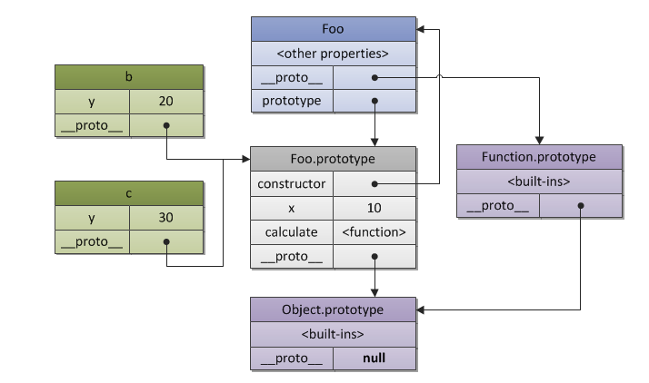

# 你不知道的JavaScript
> this&Obj Prototypes(原型链)

<!-- TOC -->

- [你不知道的JavaScript](#你不知道的javascript)
  - [1. CH1 - JUST START **this**!](#1-ch1---just-start-this)
    - [1.1 创建上下文环境(this)](#11-创建上下文环境this)
    - [1.2 改变上下文环境](#12-改变上下文环境)
    - [1.3 TIPS](#13-tips)
  - [2. CH2 - THIS全面解析](#2-ch2---this全面解析)
    - [2.1 THIS指向的改变](#21-this指向的改变)
      - [2.1.1 隐式转换](#211-隐式转换)
      - [2.1.2 显式转换](#212-显式转换)
    - [2.2 创建实体的方法](#22-创建实体的方法)
  - [3. CH3 - 对象OBJECTS](#3-ch3---对象objects)
    - [3.1 OBJECTS SOME TIPS](#31-objects-some-tips)
    - [3.2 More](#32-more)
    - [3.3 迭代器](#33-迭代器)
  - [4. CH4 - CLASS、新成员](#4-ch4---class新成员)
    - [4.1 继承 - inherits](#41-继承---inherits)
    - [4.2 复制？](#42-复制)
  - [5. CH5 - 原型链 - PROTOTYPES](#5-ch5---原型链---prototypes)
    - [5.1 初步 - 创建类的几个方法](#51-初步---创建类的几个方法)
    - [5.1.1 初步 - 关于其的一些小TIPS/注意](#511-初步---关于其的一些小tips注意)
  - [5.2 通过原型链继承](#52-通过原型链继承)
  - [6. CH6 - 委托](#6-ch6---委托)
  - [7. 附录A ES6 - CLASS](#7-附录a-es6---class)
    - [7.1 优点与坑](#71-优点与坑)
  - [8. 总结](#8-总结)

<!-- /TOC -->

## 1. CH1 - JUST START **this**!

还是那句话, 任何类型都是对象. 所以对象都可以有`this`的属性, 包括`function`或者`{}`创建的对象. 

### 1.1 创建上下文环境(this)

当我们创建了一个对象之后, 我们如何使用(或者说是改变)绑定在`this.xxx`上的东西. 类比`python self`, 只有我们通过`xx = a()`令一个`xx`等于一个类创建的实体.

所以在JavaScript中, 你要真正使用对象内部的属性方法, 最好就是通过`var`创建这样一个实体, 或者是通过`new`. 以下:

```JavaScript
function foo(num) {
	console.log( "foo: " + num );

	// keep track of how many times `foo` is called
	this.count++;
}

foo.count = 0;

var i;

for (i=0; i<10; i++) {
	if (i > 5) {
		foo( i );
	}
}
// foo: 6
// foo: 7
// foo: 8
// foo: 9

// how many times was `foo` called?
console.log( foo.count ); // 0 -- WTF?
```

直接使用`foo`是没有效果的. 指的是无法作用在`foo`中的`this`. 如果我们要改变这一情况, 那么就只有通过另外的方法, 用**其他东西代替`this`**, 例如:

```JavaScript
function foo(num) {
	console.log( "foo: " + num );

	// keep track of how many times `foo` is called
	foo.count++;
}
``` 

### 1.2 改变上下文环境

上下文环境指的就是`this`指向的哪一个对象. `window`或者是`function`之类.

* `A.call(B)`可以将A的上下文环境改变成B

### 1.3 TIPS

类比`python`, 类中的属性方法想要属于这个类, 必须是通过`self.xxx`创建或者改变. 其余的方法创建变量都是暂时的变量.

那么在`JavaScript`中, 想要在那属性方法属于这个类, 必须通过`this.xxx`创建或者改变. 其余的`var a = 2`在对象中创建都是属于临时变量, 无法被外部访问的. 类如以下:

```JavaScript
function foo() {
	var a = 2;
	this.bar();
}
```

就算你通过`var v = new foo()`也是无法访问变量`a`

## 2. CH2 - THIS全面解析

### 2.1 THIS指向的改变

* 上下文=指向。
* 实体=类。
	* `new`可以创建实体
	* `var`创建`object`，本章出现的都是`var xx = {}`

#### 2.1.1 隐式转换

其实`this`是非常容易让人生成误解的。但要明确规则：

* `this`指代的上下文，在**调用时被改变**!

```JavaScript
function foo() {
	console.log( this.a );
}
```

当我们这样创建`foo`的时候，此时`this`指向的是`windows`。只有通过`new`之类创建`foo`的实体的时候，`this`的上下文（也就是指向）发生了改变。

**所以，注意**：

* 任何出现`var`或者`new`的地方，千万注意`this`的变化。
* 作为参数传递的时候，也会改变`this`的指向

#### 2.1.2 显式转换

以下都会改变`this`**临时**上下文。具体用法看文档。**注意：如果`xxx.bind(yyy)`，并不是说yyy具有属性xxx（可以通过yyy.xxx调用那种）。仅仅只是xxx的上下文变成yyy**：

* `.call()`
* `.apply()`
* `.bind()`，这个可以查看绑定到了什么地方。
	* 注意`bind`是具有返回数值的，即返回这个对象**引用**（因为发现并不是返回一个实体）
	* 这个有一点很神奇且奇怪的地方，`bind`可以传递额外的参数（取决于`xx.bind(obj, zz)`的`xx`），而且这个参数保留，至少在用`new`创建实体的时候，这个参数依旧可以使用。这个属性叫**`curry`**，并不是`bind`独有。而是普遍。
* 还有`ES6`新特性，箭头函数`=>`，箭头函数捕获上下文`this`作为自己的`this`。

**curry**特性：

```JavaScript
var greetCurried = function(greeting) {
  return function(name) {
    console.log(greeting + ", " + name);
  };
};
```
特别的是`greetCurried`显然是一个函数，**可是到底是具有两个参数的函数？还是一个？**

* 第一种：
```JavaScript
var greetHello = greetCurried("Hello");
greetHello("Heidi"); //"Hello, Heidi"
```
* `greetCurried("Hi there")("Howard")`

所以发现，如果：

* 返回值是一个函数
* 且该函数具有多个参数

该函数可以调用两次，且第一次**参数保留**（用法可能要参考第一种/或者第二种，并不是没有限制）。

### 2.2 创建实体的方法

* 常用的`new`
* 不常用的`Object.create(xxx)`
* 不明显的`var a = {...}`

## 3. CH3 - 对象OBJECTS

简单的分类:

* `literal syntax` - 通过`var xx = {...}`创建对象
* `constructed form`- 通过`new`关键字
 
### 3.1 OBJECTS SOME TIPS

* 对象属性的获取支持两种形式：
	* `.xx`
	* `['xx']`
		* 关于这一点，值得注意的是，对象的属性名（也就是`xx`）必须也只能是`str`。如果不是会被强制转换，例如`myObject[myObject] = "baz"`会变成`myObject["[object Object]"]`
* 可计算属性名（Computed Property Names）
  ```
	[a + b]: xxx
	```
	在对象内部是可以被支持的，不过是在`ES6`
* `getOwnPropertyDescriptor`等一系列，可以定义对象内部属性。类似给对象加上权限之类。

### 3.2 More

还有更多关于对象的东西，特别多，不一一看了。全部的关于`Object`的属性方法全在`MDN`[官方文档](https://developer.mozilla.org/zh-CN/docs/Web/JavaScript/Reference/Global_Objects/Object/seal)。

### 3.3 迭代器

不要局限`every`、`for..each`等等只在`array`对象上面。其实任何对象都是可以使用这些个函数，例如：

```JavaScript
var a = {
  x: 10,
  y: 20,
};

for (var [name, value] of Iterator(a)) {  // @@iterator is used
  console.log(name, value);   // x 10
                              // y 20
}
```

这只是一个例子。

## 4. CH4 - CLASS、新成员

依旧很难理解，可能也是不怎么使用这一部分的缘故了。

JavaScript支持的`class`创建类，以下就是模板（**不过这个关键字我是没有用过的，太高级了**）：

```JavaScript
class CoolGuy {
	specialTrick = nothing

	CoolGuy( trick ) {
		specialTrick = trick
	}

	showOff() {
		output( "Here's my trick: ", specialTrick )
	}
}
```

### 4.1 继承 - inherits

* 类继承的语法规则为 - `class Car inherits Vehicle`
* 继承之后如何调用父类的方法 - `inherited:drive()`，看这一章节的意思。`ES6`有个`super`作用等价（或者替代了`inherited`?）

以上的确是不常用的`JavaScript`类的书写方式，而更为常见的是，通过`function`+`prototype`书写自己的类。

* 继承 - 
	```JavaScript
	function Car() {
		// first, `car` is a `Vehicle`
		var car = new Vehicle();

		// now, let's modify our `car` to specialize it
		car.wheels = 4;

		// save a privileged reference to `Vehicle::drive()`
		var vehDrive = car.drive;

		// override `Vehicle::drive()`
		car.drive = function() {
			vehDrive.call( this );
			console.log( "Rolling on all " + this.wheels + " wheels!" );
		};

		return car;
	}
	```

### 4.2 复制？

如题，复制一个新类到另外一个类。并添加额外的属性方法。

书中`Mixins`提供了一个方法。**注意同名函数的调用**。

## 5. CH5 - 原型链 - PROTOTYPES

结合类的一些知识一起来理解。来理一理原型链的一些知识，首先看这个图：

<div style="text-align:center" markdown="1">
     
     <p><strong>图1、 __proto__和prototype</strong></p>
</div>

以及回忆一下，之前我们创建一个类（用`function`的方式）。一般我们都是通过下面这个方式：

```JavaScript
function Foo() {
	// ...
}
Foo.prototype.xxx =  something
```

如果通过`a = new Foo()`之后就不可以通过这样的`prototype`来添加额外的了。也就是不支持动态的追加属性了，这也是可以理解的。

在**thisandgrammer.md**中：

> * `String()`
> * `Number()`
> * `Boolean()`
> * **`Array()`**
> * **`Object()`**
> * **`Function()`**
> * `RegExp()`
> * `Date()`
> * `Error()`
> * `Symbol()`

发现`function`属于内建函数的一种（不过话说回来，似乎也就只有`function`可以通过这样的方式添加`prototype`）。这里只是想说明，只有内建函有**直接的属性**`prototype`，其他的**通过`var a = {...}`创建的其实并没有`a.prototype`的属性。**

结合图1，发现除了`prototype`之外，类（或者对象）其实还有很多属性，比如`__proto__`和`constructor`。那么`__proto__`和`prototype`有说明关系呢？

* `__proto__`指向的是父类，就像是`function`指向的是`obj`。如果`a = new Foo()`，那么`a`指向的就是`function`。而且`a`的`__proto__`里面包含的是`function`的`prototype`。相当于我复制了一份`function`的`prototype`到`a`里面。以次类推，`a`的`__proto__`的`function`，还有一个`__proto__`，etc...
* 所以`__proto__`可以理解为存放指针的地方，而这个指针就是`prototype`

不清楚你就，`a = new Foo()`把`a`打印出来看看。

那么通过`var a = {...}`创建的`prototype`又在哪里呢，可能在`constructor`里面，还是那句话，打印出来看看。

### 5.1 初步 - 创建类的几个方法

* `var a = {}` - 没有直接的`prototype`
* `new` - 会调用`constructor`/无法继续添加`prototype.xx`
* `Object.create()` - 
	* 经验性的总结就是，传入的参数最好是一个**对象**，即通过以上两点创建的。
	* 不是，也不会报错。就是要清楚，`Object.create(xx)`返回的是一个到`xx`的链接。**也即是说返回的是一个等价`xx`的东西。** 最好小心使用！
	
### 5.1.1 初步 - 关于其的一些小TIPS/注意

* 可以通过`.`来设置对象的一些属性。其实调用的是`[[GET]]`方法。
* 最好通过`Object`中内建的一些方法，来**获取/判断对象的属性**
* 我们通过`a = new Foo()`来创建一个`a`的时候，其实并不是得到一个复制对象。其实从`a.xx`调用`xx`方法的时候，可以从这个角度理解，就是其实是通过`[[GET]]`来查找`xx`方法，在`prototype`或者更早的`prototype`
* 在之前的实践中，往往经验告诉我们，通过`instanceof`效果比`typeof`更为优秀。这里提到了一种更好的方式，就是通过`Foo.prototype.isPrototypeOf( a )`，大致含义就是：
  > 在a的整个[[Prototype]]链中，Foo.prototype出现过吗？

* 但这并不能一言确定，因为以上`instanceof`以及以上推荐的方法往往只适合通过`new`关键字创建的。`typeof`适合大多数情况，比如`a = 'super'`，对`a`判断是否属于字符串。
  
## 5.2 通过原型链继承

文中提供了一个模板：

```JavaScript
function Foo(name) {
	this.name = name;
}

Foo.prototype.myName = function() {
	return this.name;
};

function Bar(name,label) {
	Foo.call( this, name );
	this.label = label;
}

// 这里，我们创建一个新的`Bar.prototype`链接链到`Foo.prototype`
Bar.prototype = Object.create( Foo.prototype );

// 注意！现在`Bar.prototype.constructor`不存在了，
// 如果你有依赖这个属性的习惯的话，可以被手动“修复”。

Bar.prototype.myLabel = function() {
	return this.label;
};
```

## 6. CH6 - 委托

JavaScript里面的继承委托十分难以理解，所以这里提到了委托。希望把继承的概念转换为链接（委托）。被称之为**OLOO**：面向链接（委托）。

在**5.2节**中，利用的是通过原型链创建对象（继承）。这里指的是用委托，完全不一样的思维方式。

文中认为委托的方式实现的继承比原型链继承更加优秀。**委托代码**示例如下：

```JavaScript
var Foo = {
	init: function(who) {
		this.me = who;
	},
	identify: function() {
		return "I am " + this.me;
	}
};

var Bar = Object.create( Foo );

Bar.speak = function() {
	alert( "Hello, " + this.identify() + "." );
};

var b1 = Object.create( Bar );
b1.init( "b1" );
var b2 = Object.create( Bar );
b2.init( "b2" );

b1.speak();
b2.speak();
```

这里可能没办法发现两者到底区别优秀的地方，主要是在`__proto__`等指向上面，委托的概念比原型链的概念更加优秀一点。

**注意**：
* 如果以上示例代码是通过`function`，那么`var Bar = Object.create( Foo )`应该是`var Bar.prototype = Object.create( Foo.prototype)`才对。之后在`Bar`追加额外的方法，也是通过`Bar.prototype.xx = xx`。
* 如果要调用父类的方法，和原型链一样，都是通过`.call`方法。不过有些不同：
	* 如果是`var Bar.prototype = Object.create( Foo.prototype)`，那么应该是`Bar.prototype.call`来调用父类方法才对。

## 7. 附录A ES6 - CLASS

具体请参考语法书，在形式上和实际上，和委托一样简洁。

至于是否优秀，就要进一步阅读。

文中认为`OLOO`结合`ES6`简约的声明函数方法。可以更加优秀。

### 7.1 优点与坑

`ES6`的确解决了一些问题，包括：

* 明显的基础语法`extends`
* 明显的自定义构造器函数定义

而且看起来的确更加的简介，但是书中并不提议使用，一定有它的不足。

说实话，对于坑的地方太高深了，看不太懂...


## 8. 总结

这一章节主要讲解的`this`和`prototype`。

* `this`在什么时候出现，如何改变指向（指的就是上下文环境指向），利用`call`和`bind`
* 如何将数组的一些方法作用在普通对象上
* 关于原型链的一些知识
* 实现类的几种方式/实现类继承的一些方式，最好的办法就是利用书中所提到的委托方法。简洁有效。
* `es6`的`class`不推荐使用！仍然推荐的是委托的方法。
