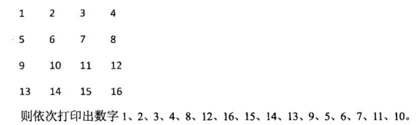
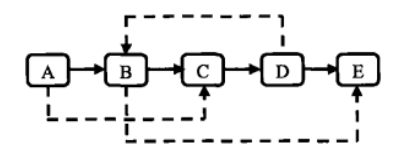

# Sword2Offer
> 剑指offer习题代码 - JavaScript版本

## 0. Introduction

Base on `nodejs`, so please install `nodejs` on your pc!

And the files `*-es6.js` rewrited in es6. In `2017-08-06`, I have to install `babel` to support some features of `ES6`. Please follow this [guide](http://www.ruanyifeng.com/blog/2016/01/babel.html) to install `babel`.

Then, the es6 guide(zh_cn) is [here](http://es6.ruanyifeng.com/)

### 0.1 How to use it?

* `clone` this project
* `node install`
* and follow below suggestion!

## 1. Singleton

singleton, `obj` can only be instantiated once( `var a = new Foo()` just once).

### 1.1 How to use it?

`node singleton.js`

## 2. Find target in matrix

The matrix has special formattion: the item in row, from left to right become bigger; the item in col, from top to bottom become bigger.

So, find a target in this matrix has special way. Just like this imgs show in `sword2offer.pdf`:

### 2.1 How to use it?

* Open command, `node matrix-find-target.js` or `node matrix-find-target-es6.js`

## 3. Replace Str

Javascript already write some funcs, but the way in sword2offer: 

* new **2 point**, put the one at last letter of  str, put another one at (last letter + some length) of str
* in JS, you have split str into array

### 3.1 How to use it?

`node replace-str-space.js` or `node replace-str-space-es6.js`

## 4. Revert print the value of link list

Get the val of link list, and print the value in revert order.

### 4.1 How to use it?

`node revert-print-linklist.js` or `node revert-print-linklist-es6.js`

## 5. Reconstruct Binary Tree

Reconstruct Binary Tree by preorder and inorder.

### 5.1 How to use it?

`node reconstruct-btree-by-preandinorder-es6.js` or `node reconstruct-btree-by-preandinorder.js`

## 6. Combine two stack into queue

First, you have to konw about what is stack and queue. Please google it...

Use two stacks to make class have some features of queue.

### 6.1 How to use it?

`node twostack-into-que-es6.js` or `node twostack-into-que.js`

## 7. Find the min value of Rotate arr

Find the min value of rotate array, if we have a special array just like that `[i, i+1, ..., i+n]`, the rotation of this array just like that `[i+j, ..., i+n, i, ...i+(j-1)]`. So use dichotomy to find the min value in this arr

### 7.1 How to use it?

`node find-minvalue-in-rotatearr.js` or `node find-minvalue-in-rotatearr-es6.js`

## 8 Fibonacci Problem

We often use the recursive way to solve the fibonacci problem, the recursive problem lies in the large amount of resource consumption and the repeated calculation.

The solution is calculated from 0,1 to n, rather than recursion from n to 0,1

### 8.1 How to use it?

`node fibonacci-problem.js` or `node fibonacci-problem-es6.js`

## 9. Byte Operation

In a word, count the number in binary type of a decimal type number. For example, `1001(9)` is equal `2`.

And other related applications in this area.

### 9.1 How to use it?

`node byte-operation.js` or `node byte-operation-es6.js`

## 10. Power with unsigned exponent

A implement of $a^{b}$. Use recursive and byte operation just like the way in **Chapter 9th**.

The theory of this implement is:

### 10.1 How to use it?

`node power-with-unsignednum-es6.js` or `node power-with-unsignednum.js`

## 11. Print max of N digits

If n = 3, just print `1,2,3...999`. Use str, not add int.

### 11.1 How to use it?

`node print-to-maxof-ndigits-es6.js` or `node print-to-maxof-ndigits.js`

## 12. Delete node in LinkList

If we already have **to_delete_node: a**，implement the O(1) complexity algo to delete the node **a**.

### 12.1 How to use it?

`node delete-node-in-list.js` or `node delete-node-in-list-es6.js`

## 13. Reorder Array

Reorder Array by condition. Just like making odd number in front of even number in array.

### 13.1 How to use it?

`node reorder-array.js` or `node reorder-array-es6.js`

## 14. Find Kth node to tail

Find the last kth node by less traversal steps.

### 14.1 How to use it?

`node find-kth-node-totail.js` or `node find-kth-node-totail-es6.js`

## 15. Reverse Linklist

Reverse Linklist by three pin.

### 15.1 How to use it?

`node reverse-linklist.js` or `node reverse-linklist-es6.js`

## 16. Merge SortedLinklist

Merge two sorted LinkList into ONE. And, keep the origin order.

### 16.1 How to use it?

`node merge-sortedlinklist.js` or `node merge-sortedlinklist-es6.js`

## 17 Substrcut in tree

Judge tree b is a sub structure of tree b. The tree a/b shows below:

### 17.1 How to use it?

`node substruct-intree.js` or `node substruct-intree-es6.js`

### 18 Mirror the Btree

Exchange all left and right nodes of the binary tree.

### 18.1 How to use it?

`node mirror-of-btree.js` or `node mirror-of-btree-es6.js`

## 19 Print matrix in clock order

Just like below pics shows:

### 19.1 How to use it?

`node print-matrix-inclock.js` or `node print-matrix-inclock-es6.js`

## 20. Min in stack

Realtime get min value in stack!

### 20.1 How to use it?

`node min-in-stack.js` or `node min-in-stack-es6.js`

## 21. Stack push pop order

Judge pop order is possible for a stack

### 21.1 How to use it?

`node stack-push-pop-order.js` or `node stack-push-pop-order-es6.js`

## 22. Print Level Order Btree

Print the Btree in level order(just like the pre-order)

### 22.1 How to use it?

`node print-level-order.js` or `node print-level-order-es6.js`

## 23. Verify squence of BST

Verify that the array is a binary output of the binary search tree.

### 23.1 How to use it?

`node verify-squence-of-bst.js` or `node verify-squence-of-bst-es6.js`

## 24. Path in tree

Find the path that the sum of all nodes'value in path eqauls expected value

### 24.1 How to use it?

`node path-in-tree.js` or `node path-in-tree-es6.js`

## 25. Copy complex list

Copy complex List, the complex list just like below.

### 25.1 How to use it?

`node copy-complex-list.js` or `node copy-complex-list-es6.js`

## 26. Conver BStree

Convert a BSTree into double link list

### 26.1 How to use it?

`node convert-bst.js` or `node convert-bst-es6.js`

## 27. String Permutation

All possibilities for printing strings are arranged. Such as `abc`, we get `[acb, bca, bac, cab, ...]`

### 27.1 How to use it?

`node string-permutation.js` or `node string-permutation-es6.js`
